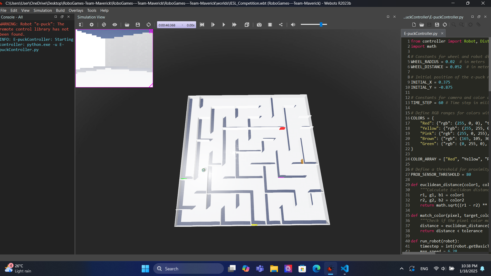
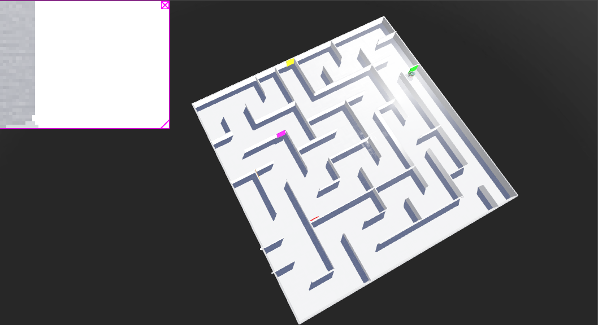

# Maze Wall Colors Following Robot - RoboGames 2024 University Category

This project was developed for the RoboGames 2024 University Category Completion Round. It involves designing and simulating an E-puck robot in Webots to navigate a maze while identifying walls by their colors and following a specific sequence of actions.

## Project Overview

### Objective
The robot must navigate through a 2.5m x 2.5m maze with colored walls, following the sequence:
- Red → Yellow → Pink → Brown → Green
The robot stops after completing the sequence.

### Simulation Environment
- **Arena Dimensions**: 2.5m x 2.5m grid with 0.25m gaps between walls.
- **Wall Properties**:
  - Height: 0.1m
  - Breadth: 0.01m
  - Length: Multiples of 0.25m
  - Colors: Red (#FF0000), Yellow (#FFFF00), Pink (#FF00FF), Brown (#A5691E), Green (#00FF00)
- **Robot**: E-puck robot used for simulation.

### Features
- Real-time wall color detection using Webots sensors.
- Dynamic decision-making to navigate the maze and follow the pattern.
- Designed for adaptability to any starting position in the maze.

## Setup Instructions

### Prerequisites
- Install [Webots](https://cyberbotics.com/).

### Clone the Repository
To get started, clone the repository:
```bash
git clone https://github.com/your-repo-link.git
cd maze-wall-colors-following-robot
```



